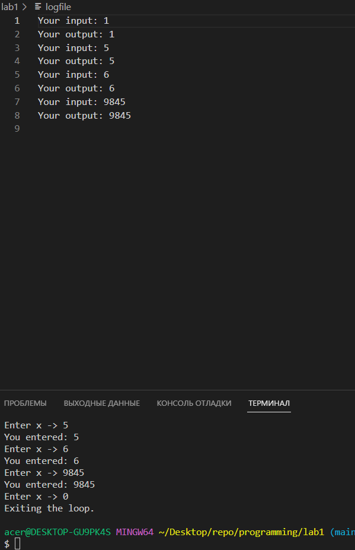

# programming
lab №1 (Уровень Medium)

# Отчет 
## Задание
Сложность:
  Rare
    
    Сделайте свою программу выполняющейся до тех пор, пока пользователь не введёт все нулевые значения.
    Реализуйте сохранение вывода программы и пользовательского ввода в лог-файл.


## Этапы работы
### 1. Напишите программу
```
#include <stdio.h>

int main() {
    int x;
    FILE *file = fopen("logfile", "a"); 
    if (file == NULL) {
        printf("Error!\n");
        return 1;
    }
    
    while (1) {
        printf("Enter x -> ");
        scanf("%d", &x);
        if (x == 0)
            break;
        printf("You entered: %d\n", x);
        fprintf(file, "Your input: %d\n", x);  
        fprintf(file, "Your output: %d\n", x); 
    }
    
    printf("Exiting the loop.\n"); 
    fclose(file); 
    return 0;
}
```

`FILE *file = fopen("logfile", "a");` используется для открытия файла с именем `logfile` в режиме "дописывание в конец".

В языке C, функция `fopen()` используется для открытия файла и ассоциирования файлового указателя (FILE *) с этим файлом. Параметр `logfile` представляет имя файла, который нужно открыть.

Режим `"a"` вторым аргументом `fopen()` означает "дописывание в конец" (append). Если файл уже существует, новый вывод будет добавляться в конец файла, а если файл не существует, то он будет создан. 

Далее код проверяет, успешно ли был открыт файл. Если файл не удалось открыть (например, из-за отсутствия прав доступа или несуществующего файла), функция `fopen()` вернет `NULL`. В этом случае код выводит сообщение об ошибке `printf("Error!\n");` и завершает программу с возвращением значения 1.

### 2. Результаты


## Список использованных источников:
1. https://www.youtube.com/watch?v=6I3wA2yQVis
