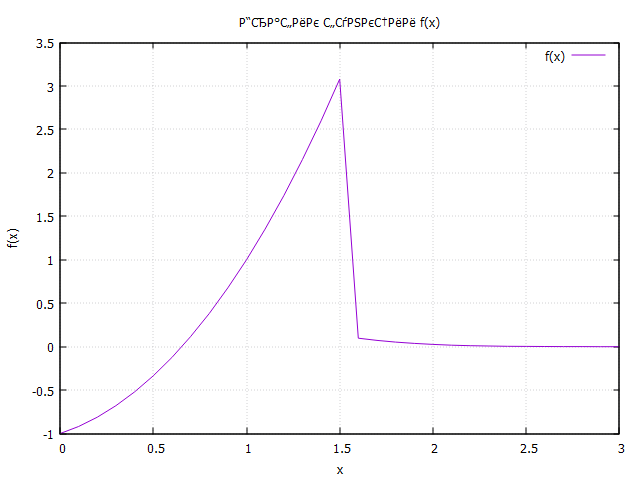

# programming
lab №1

# Отчет 
## Задание
Сложность:
  Rare
   
    1. Напишите программу по варианту, используя оператор цикла while (нечётные варианты) или do while (чётные варианты).
    2. Напишите программу, используя оператор цикла for.
    3. Постройте график с использованием gnuplot.
    4. Составьте блок-схемы.
    5. Оформите отчёт в README.md. Отчёт должен содержать:
        5.1 Задание
        5.2 Описание проделанной работы
        5.3 Скриншоты результатов
        5.4 Блок-схемы
        5.5 График функции
        5.6 Ссылки на используемые материалы

## Этапы работы
 ## Вариант - 5
 ### 1. Напишите программу по варианту, используя оператор цикла while (нечётные варианты) или do while (чётные варианты).
 ```
#include <stdio.h>
#include <math.h>

int main()
{
    double x = 0.0, y;
    double eps;
    double h;
    scanf("%lf", &h);
    eps = h / 2.0;
    printf("x\t\ty\n");
    while(x >= 0.0 && x <= 3.0 + eps)
    {
        if(x <= 1.5 + eps)
          y = pow(2.0, x) - 2.0 + pow(x, 2);
        else
          y = sqrt(x) * exp(-pow(x, 2));
        printf("%f\t%f\n", x, y);
        x = x + h;
    }
    return 0;
}

```
 ### 2. Напишите программу, используя оператор цикла for.
 ```
 #include <stdio.h>
#include <math.h>

int main()
{
    double x = 0.0, y;
    double eps;
    double h;
    scanf("%lf", &h);
    eps = h / 2.0;
    printf("x\t\ty\n");
    for(x = 0.0; x <= 3.0 + eps; x = x + h)
    {
        if(x <= 1.5 + eps)
          y = pow(2.0, x) - 2.0 + pow(x, 2);
        else
          y = sqrt(x) * exp(-pow(x, 2));
        printf("%f\t%f\n", x, y);
    }
    return 0;
}
 ```
 ### 3. Постройте график с использованием gnuplot.
 
 
 `Заголовок получился такой, потому что gnuplot у меня не поддерживает символы на русском.`
 ### 4. Составьте блок-схемы.
 