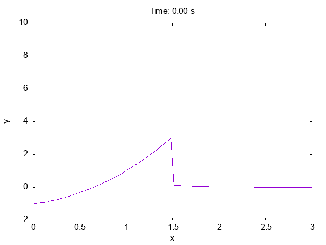

# programming
lab №2

# Отчет 
## Задание
Сложность:  Medium
    
    Используйте gnuplot напрямую из вашей программы, минуя файлы и перенаправление вывода.
    Реализуйте анимацию построения графика.
    Сохраните анимированный график в формате gif.

## Этапы работы
### Код
```c
set term gif animate
set output 'animation.gif'

totalTime = 10.0

do for [t=0:100] {
    h = 3.0 / 100.0 * t
    eps = h / 2.0
    
    set xrange [0:3]
    set yrange [-2:10]
    
    set title sprintf("Time: %.2f s", t / 10.0)
    set xlabel "x"
    set ylabel "y"
    
    plot '+' u 1:(x <= 1.5 + eps ? (2**x - 2 + x**2) : (sqrt(x) * exp(-x**2))) w l notitle
    
    pause 0.1
}

set output
```

Командой `set term` gif animate мы задаем формат gif для создания анимации. Затем указываем файл "animation.gif", в который будет сохранена анимация, с помощью команды set output 'animation.gif'.

В переменной `totalTime` задается общее время анимации, в данном случае оно равно 10.0 секунд.

В цикле `do for [t=0:100]` мы перебираем значения от 0 до 100 (включая границы) с шагом 1. Для каждого значения выполняются следующие команды:

Переменная `h` вычисляется как 3.0 / 100.0 * t. Затем вычисляется переменная `eps` как h / 2.0.

Командами `set xrange [0:3]` и `set yrange [-2:10]` устанавливаются диапазоны значений для осей x и y соответственно.

С помощью команд `set title`, `set xlabel` и `set ylabel` заголовок графика и подписи осей x и y устанавливаются.

Строка `plot '+' u 1:(x <= 1.5 + eps ? (2**x - 2 + x**2) : (sqrt(x) * exp(-x**2))) w l notitle` отвечает за рисование графика в анимации.

Здесь используется запись '+' u 1:(...), где '+' означает, что мы рисуем график из входных данных, а 1:(...) указывает на использование значения из первого столбца входных данных (в данном случае мы используем значения x) и значения, вычисленного в выражении в круглых скобках (в данном случае мы вычисляем значения y).

Выражение `(x <= 1.5 + eps ? (2**x - 2 + x**2) : (sqrt(x) * exp(-x**2)))` определяет, какие значения принимает y в зависимости от значения x. Это условное выражение выбирает значение (2**x - 2 + x**2), если значение x меньше или равно 1.5 + eps, иначе выбирает значение (sqrt(x) * exp(-x**2)).

Команда `w` `l` указывает, что график будет рисоваться линией.

Команда `notitle` указывает на то, что графику не будет присвоен заголовок

Командой `pause 0.1` программу останавливают на 0.1 секунды после каждого кадра, чтобы создать задержку между кадрами анимации.

После окончания цикла командой `set output` сбрасывается вывод.

### Результат


### Список использованных источников
1. [ГНУПЛОТ. Анимация](http://fsweb.info/gnuplot/animation.html)