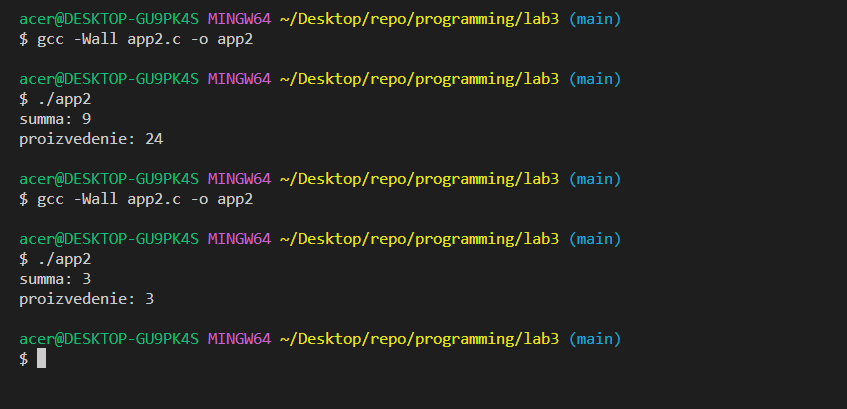

# programming 
lab №3
# Отчет 
## Задание
Сложность:
  Rare
    
    1. Напишите программу по своему варианту.
    2. Оформите отчёт в README.md. Отчёт должен содержать:
          2.1 Задание
          2.2 Описание проделанной работы
          2.3 Скриншоты результатов
          2.4 Ссылки на используемые материалы

## Этапы работы
### 1. Задание по Варианту №5
`
Вычислить сумму и произведение элементов между двумя повторяющимися элементами массива и записать вычисленные значения вместо повторяющихся.
`

### 2. Код
```
#include <stdio.h>

int main() 
{
    int arr[] = {6, 2, 3, 4, 6};
    int size = sizeof(arr) / sizeof(arr[0]);
    int sum = 0;
    int proizvedenie = 1;
    for (int i = 0; i < size; i++) 
    {
        for(int j = i + 1; j < size; j++) 
        {   
            if (arr[j] == arr[i]) 
            {
                for (int k = i + 1; k < j; k++) 
                {
                    sum += arr[k];
                    proizvedenie *= arr[k];
                }
            }
        }
    }
    printf("summa: %d\n", sum);
    printf("proizvedenie: %d\n", proizvedenie);
    return 0;
}
```
### 3. Результаты


`
От перестановки элементов, программа не перестает работать. Можно даже добавлять элементы.
`

### 4. Список использованных источников 
1. https://www.youtube.com/@PortfolioCourses/playlists