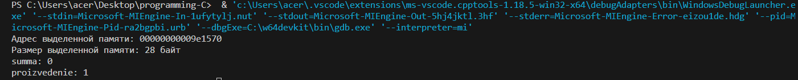

# programming 
lab №3
# Отчет 
## Задание
Сложность:  Medium

    Используйте динамическое выделение памяти для хранения данных программы

## Этапы работы
### Код 
```c
#include <stdio.h>
#include <stdlib.h> // Добавляем заголовочный файл для динамического выделения памяти

int main()
{
    int arr[] = {2, 6, 3, 8, 9, 6, 4};
    int size = sizeof(arr) / sizeof(arr[0]);

    int *dynamicArr = (int *)malloc(size * sizeof(int)); // Выделяем память под массив динамически

    printf("Адрес выделенной памяти: %p\n", (void *)dynamicArr);
    printf("Размер выделенной памяти: %lu байт\n", size * sizeof(int));

    int sum = 0;
    int proizvedenie = 1;
    for (int i = 0; i < size; i++)
    {
        dynamicArr[i] = arr[i]; // Копируем значения из исходного массива в динамический
        for (int j = i + 1; j < size; j++)
        {
            if (dynamicArr[j] == dynamicArr[i])
            {
                for (int k = i + 1; k < j; k++)
                {
                    sum += dynamicArr[k];
                    proizvedenie *= dynamicArr[k];
                }
            }
        }
    }
    printf("summa: %d\n", sum);
    printf("proizvedenie: %d\n", proizvedenie);

    free(dynamicArr); // Освобождаем выделенную память

    return 0;
}
```

### Результат


### Список использованных источников
1. [Динамическая память.](https://metanit.com/c/tutorial/5.8.php)
